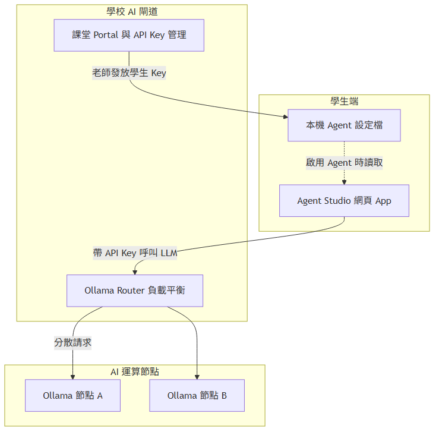
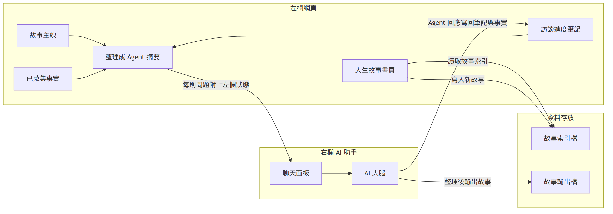
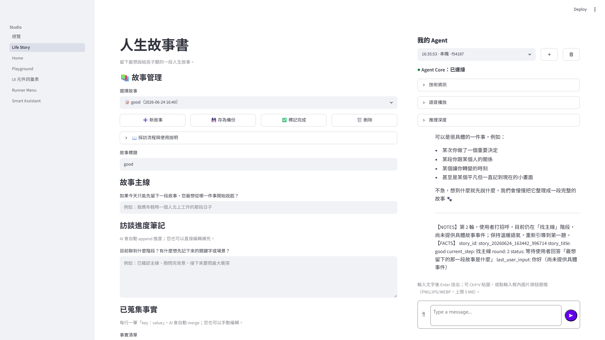

# 人生故事書

**組別／組員**：個人專題
**日期**：2026-06-24

---

## 1. 專題介紹

「人生故事書」是一個讓父母留下「最想說給孩子聽」的一段人生故事的 App。

- **專題名稱**：人生故事書
- **一句話**：留下最想說給孩子聽的一段人生故事
- **主要使用者**：父母
- **想解決的問題**：小孩常常不知道父母的經歷，缺乏理解

透過採訪式的引導流程，父母只要輸入一句「故事主線」，右欄的 AI 助手就會沿著主線依序追問——背景、開端、衝突、決定、結果、意義，最後整理成一段「留給孩子的話」。過程中所有筆記與事實都會自動寫回左欄，父母不需要手動抄錄。

---

## 2. 學校 Server 環境

本專題透過學校提供的 API Key 呼叫 Ollama Router，由 Router 分配至後端 Ollama 節點執行 LLM。下圖為全班相同之 server 拓撲（報告不標示 Router 位址）。

---

## 3. 系統概覽

左欄 Streamlit 自訂頁與右欄 Agent 的互動如下。

### 3.1 左欄自訂頁

- **人生故事書**（`10_Life_Story.py`）：父母輸入故事主線、查看訪談進度筆記、編輯已蒐集事實，並可切換／新增／備份／刪除故事。

### 3.2 左欄傳給 Agent

- 用 `format_extra_context` 把左欄三區塊（故事主線／訪談進度筆記／已蒐集事實）打包成一段摘要文字，附加在右欄每一則使用者問題後送出。

### 3.3 Agent 寫回哪裡

- Agent 回應結尾的 `【NOTES】` 區塊會被左欄自動 append 到「訪談進度筆記」。
- Agent 回應結尾的 `【FACTS】` 區塊會被左欄自動 merge 到「已蒐集事實」。
- 資訊足夠後，父母說「可以整理成故事了」，Agent 會把整段故事輸出成 `.md` 檔，存到 `story_outputs/`。

### 3.4 完整例子

父母在「人生故事書」輸入「北上工作是我人生第一次真正離家打拚的開始」→ 右欄 Agent 沿主線依序追問（背景→開端→衝突→決定→結果→意義→留給孩子的話）→ 每輪 Agent 回應結尾的 NOTES／FACTS 自動寫回左欄 → 說「可以整理成故事了」→ 產出 `.md` 到 `story_outputs/`。

---

## 4. 成果與創新

### 4.1 成果

- **人生故事書**：父母輸入故事主線 → Agent 採訪式引導（背景→開端→衝突→決定→結果→意義→留給孩子的話）→ 自動寫回左欄筆記／事實 → 產 `.md` 到 `story_outputs/` → 匯出 Word / PDF。

### 4.2 創新／亮點

- **Agent 回應自動寫回左欄**：Agent 回應結尾的 `【NOTES】` / `【FACTS】` 區塊會自動 append／merge 到左欄的「訪談進度筆記」與「已蒐集事實」，父母不需要手動抄錄。
- **採訪式引導流程**：沿「背景→開端→衝突→決定→結果→意義→留給孩子的話」七個階段依序追問，把零散的記憶整理成一段完整故事。

---

## 5. 技術含量

- **Streamlit**：左欄 UI 框架（`studio_shell/pages/10_Life_Story.py`）。
- **Agent Studio**：右欄 LLM 對話（透過學校 Ollama Router）。
- **JSON 狀態檔**：`studio_shell/data/` 儲存故事索引與進度。
- **`【NOTES】/【FACTS】` 標記解析**：Agent 回應自動寫回左欄的機制。

---

## 附錄：Demo 截圖

### 人生故事書

---

展覽用綜整海報（Step 7 另產）：`assets/專題海報.png`